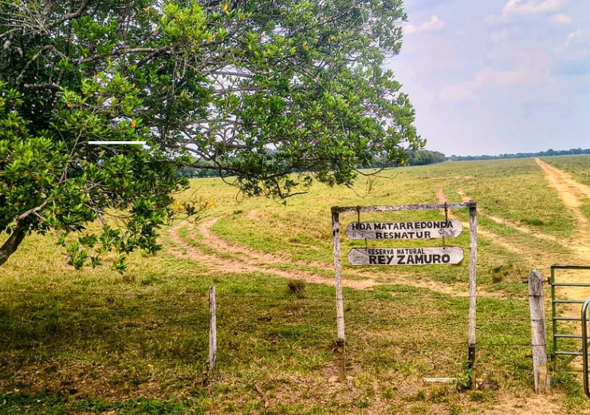

# Repositorio-RNSC-Rey-Zamuro

Plataforma web desarrollada para la RNSC Rey Zamuro, diseñada para reunir, organizar y visibilizar todas las referencias bibliográficas, investigaciones y proyectos realizados dentro de la reserva, facilitando el acceso a información científica, ambiental y educativa de manera clara, moderna y centralizada.

-----

# Noticias y referencias externas

## Biodiversidad en la Reserva
- [SiB Colombia](https://ipt.biodiversidad.co/sib/resource?r=platas_terrasos)
- [SiB Colombia](https://ipt.biodiversidad.co/sib/resource?r=terrasos_banco-habitat_dos)
- [SiB Colombia](https://ipt.biodiversidad.co/sib/resource?r=fauna_terrasos)
- [SCRIBD](https://es.scribd.com/document/553884931/Anfibios-de-La-Reserva-Rey-Zamuro-San-Martin-de-Los-Llanos-Colombia)
- [Pajarear.co](https://pajarear.co/hp/L5951354.html)

## Noticias ambientales
- [Liberación de monos churucos](https://www.eltiempo.com/colombia/otras-ciudades/tras-rehabilitacion-en-huila-monos-churucos-volvieron-a-la-libertad-300610)

## Investigaciones realizadas por Universidades
- [Universidad de los Andes](https://repositorio.uniandes.edu.co/server/api/core/bitstreams/ac5f51cc-8956-4f70-a942-1b58f691be83/content)
- [Universidad de los Andes](https://mammalogynotes.org/ojs/index.php/mn/article/download/212/455?inline=1)

